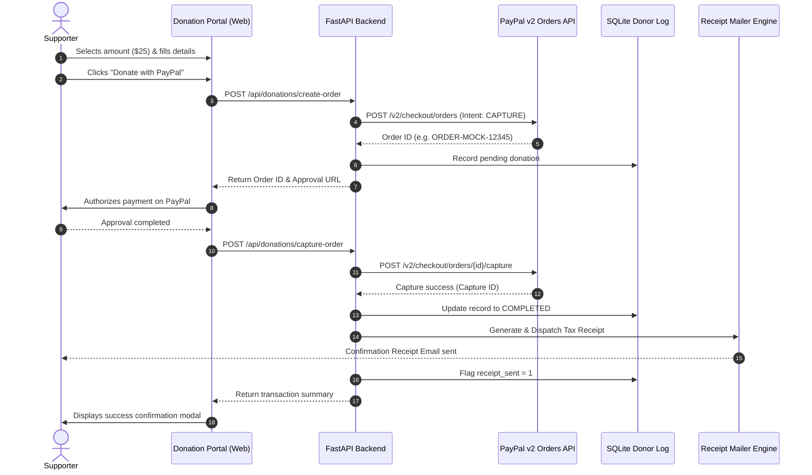

# PayPal Donation Platform

[](https://github.com/breakingthebot/paypal-donations-platform-build124/actions/workflows/ci.yml)
[](LICENSE)
[](https://www.python.org/downloads/)
[](https://fastapi.tiangolo.com/)

A modular payment and donor management solution featuring one-time **PayPal v2 Checkout** donation buttons, recurring **Monthly Sustainer Pledges & Subscriptions**, targeted **Fundraising Campaign Drives & Dynamic Goal Progress Bars**, automated **HTML & plaintext tax receipt emails**, an **SQLite-backed donor log repository**, public donor rolls with anonymity safeguards, cryptographic **PayPal Webhook verification**, automated **refund lifecycle management**, and an installable **command-line suite**.

---

## Project Description

**PayPal Donation Platform** is a production-grade, secure donation processing engine built for non-profit organizations, open-source maintainers, and community fundraising initiatives. 

The system provides a seamless donor experience on the frontend and an enterprise-grade backend:
- **One-Click Donations & Recurring Pledges**: Donors can contribute one-time or become recurring monthly sustainers via PayPal balance, debit/credit cards, or Venmo with preset amounts ($10, $25, $50, $100) or custom inputs across multiple global currencies (USD, EUR, GBP, CAD, AUD).
- **Targeted Campaign Drives & Goal Progress**: Organizations can create targeted fundraising campaigns (e.g., *Clean Water Initiative 2026*, *Hospital Relief*) with defined financial goals, real-time percentage progress bars, and dedicated campaign donor walls.
- **Automated Tax Receipting**: Immediately upon successful payment capture or recurring subscription execution, the system compiles and delivers an official 501(c)(3) tax receipt with unique receipt identifiers, deductible disclosures, and donor dedication notes.
- **Asynchronous Webhook Automation**: Receives real-time PayPal notifications (`PAYMENT.CAPTURE.COMPLETED`, `PAYMENT.CAPTURE.REFUNDED`, `BILLING.SUBSCRIPTION.ACTIVATED`, `BILLING.SUBSCRIPTION.CANCELLED`, `PAYMENT.SALE.COMPLETED`) to guarantee that payments, subscriptions, and refunds are synchronized idempotently.
- **Recurring Metrics & MRR Tracking**: Automatically aggregates active monthly sustainers, computes Monthly Recurring Revenue (MRR) grouped by currency, and manages subscription cancellation workflows.
- **Privacy & Anonymity Safeguards**: Protects donor privacy by masking public rolls as "Anonymous Supporter" when requested, while preserving internal administrative records and tax receipts.
- **Dual-Mode Architecture**: Out-of-the-box offline mock sandbox for zero-dependency local development and CI testing, with instant switching to live PayPal Sandbox or Production via environment variables.

---

## Topics Covered & Core Competencies

This project demonstrates software engineering principles and technologies across the full stack:

1. **Payment Gateway Engineering & PayPal v2 API**:
   - OAuth 2.0 Client Credentials flow with in-memory Bearer token caching and proactive renewal.
   - PayPal v2 Checkout Orders API (`/v2/checkout/orders` with `intent: CAPTURE` and `/capture`).
   - PayPal Subscriptions & Billing Agreements API (`/v1/billing/subscriptions` creation, status lookups, and cancellation).
   - PayPal Webhooks API with cryptographic signature verification and certificate URL domain safety.
2. **PCI-DSS Compliance & Security Architecture**:
   - SAQ-A compliance model: zero cardholder data (PAN, CVV, passwords) touches application memory or storage.
   - Secure server-side credential isolation via environment variables (`.env`).
   - Domain-whitelisted certificate verification preventing Server-Side Request Forgery (SSRF).
   - Replay attack mitigation and webhook event deduplication using persistent idempotency keys.
3. **Database Architecture & Data Integrity**:
   - Relational database schema design in SQLite with secondary indexes for high-frequency queries.
   - Separate indexed relational tables for one-time donations, recurring subscriptions, campaigns, and webhook audit trails.
   - Safe schema migrations ensuring existing databases seamlessly adopt new schema columns (`campaign_slug`).
   - Transactional safety and context-managed connections preventing resource leakage on Windows/Unix.
   - Aggregate financial analytics (currency-grouped sums, campaign funding percentages, distinct donor counts, running averages, Monthly Recurring Revenue).
   - Streaming data exports to CSV and JSON formats with campaign attribution.
4. **Asynchronous Processing & Event-Driven Architecture**:
   - Webhook state machine managing transaction lifecycles (`PENDING` &rarr; `COMPLETED` &rarr; `REFUNDED` &rarr; `FAILED`).
   - Subscription lifecycle automation (`BILLING.SUBSCRIPTION.ACTIVATED`, `CANCELLED`, and `PAYMENT.SALE.COMPLETED`).
   - Dedicated refund lifecycle engine that updates ledger balances and issues refund notifications.
5. **Full-Stack Web Development**:
   - FastAPI asynchronous web framework with Pydantic v2 schemas and auto-generated Swagger UI (`/docs`).
   - Single-page responsive donation portal designed with Tailwind CSS, featured campaign progress bar meters, campaign designation selectors, frequency toggles ("Give Once" vs "Give Monthly"), micro-interactions, and live metrics.
6. **Command-Line Interface (CLI) Tooling**:
   - Professional CLI built with Click and Rich, featuring formatted data tables, campaign goal tracking, KPI summary cards, subscription monitoring, and administration commands.
7. **Automated Testing & Continuous Integration**:
   - 100% offline hermetic testing via Pytest, FastAPI `TestClient`, and Click `CliRunner`.
   - GitHub Actions CI workflow executing multi-version matrix testing across Python 3.10, 3.11, and 3.12.

---

## Visual Overview


---

## Key Features

- **PayPal v2 Checkout & Subscriptions Integration**: Supports one-time donations via PayPal Orders API and ongoing recurring sustainer pledges via PayPal Subscriptions API (`/v1/billing/subscriptions`).
- **Targeted Fundraising Campaigns & Progress Bars**: Create custom campaign drives with target financial goals, automated progress calculation, and campaign-attributed donor walls.
- **Built-in Mock Sandbox & Live Modes**: Seamlessly switch between zero-credential offline development/testing (`PAYPAL_MODE=mock`), official PayPal Sandbox (`PAYPAL_MODE=sandbox`), or production (`PAYPAL_MODE=live`).
- **Automated Tax Confirmation Receipts**: Automatically compiles and renders responsive HTML and ASCII plaintext receipts for one-time contributions and subscription cycles.
- **Persistent SQLite Donor Store**: Transaction-safe local storage tracking one-time orders, recurring subscriptions, campaign metadata, amounts, currencies, and receipt delivery status.
- **Monthly Recurring Revenue (MRR) Analytics**: Tracks active sustainer counts and calculates pledged recurring monthly income broken down by currency.
- **Privacy-Preserving Public Donor Wall**: Exposes sanitized public donor records (`GET /api/donations/donors`) with optional campaign filtering and donor anonymity preferences ("Anonymous Supporter").
- **Financial Analytics & Export**: Computes total raised by currency, donor counts, and average contributions. Supports one-click CSV and JSON exports for bookkeeping.
- **Installable CLI (`paypal-donations`)**: Terminal tool powered by Click and Rich for viewing formatted donor rolls, tracking campaign progress, checking financial statistics, managing recurring subscriptions, exporting data, testing email delivery, and starting the web server.

---

## Architecture & Flow



---

## Project Structure

```text
paypal-donations-platform/
├── .github/
│   └── workflows/
│       └── ci.yml                 # Automated CI testing matrix (Python 3.10-3.12)
├── docs/
│   └── assets/
│       └── donation_portal_preview.jpg # Visual UI screenshot
├── src/
│   └── paypal_donations/
│       ├── __init__.py            # Package metadata and version definition
│       ├── api.py                 # FastAPI backend & embedded Tailwind donation portal
│       ├── cli.py                 # Click & Rich terminal command-line tool
│       ├── email_service.py       # HTML & Plaintext receipt compiler and dispatcher
│       ├── models.py              # Pydantic schemas, enums, and validations
│       ├── paypal_client.py       # PayPal v2 API client and mock sandbox engine
│       ├── repository.py          # Persistent SQLite database operations and exports
│       └── webhooks.py            # Cryptographic webhook verification and event routing
├── tests/
│   ├── test_api.py                # FastAPI route and integration tests
│   ├── test_campaigns.py          # Campaign drive CRUD, progress meters, and filtering tests
│   ├── test_cli.py                # Click CliRunner test suite
│   ├── test_email_service.py      # Email rendering and receipt generation tests
│   ├── test_paypal_client.py      # PayPal client authentication and capture tests
│   ├── test_repository.py         # SQLite CRUD, stats, and export tests
│   ├── test_subscriptions.py     # Recurring pledges, MRR metrics, and subscription tests
│   └── test_webhooks.py           # Cryptographic signature and event processing tests
├── .env.example                   # Environment configuration template
├── .gitignore                     # Git ignore rules (includes AGENTS.md)
├── CHANGELOG.md                   # Semantic version change history
├── LICENSE                        # MIT License
├── pyproject.toml                 # Standard packaging and project metadata
└── requirements.txt               # Direct pinned dependencies
```

---

## Quickstart & Installation

### 1. Prerequisites
- Python 3.10 or newer.

### 2. Environment Setup
Clone the repository and create an isolated virtual environment:

```bash
git clone https://github.com/breakingthebot/paypal-donations-platform-build124.git
cd paypal-donations-platform-build124

# Create virtual environment
python -m venv venv

# Activate virtual environment
# Windows (PowerShell):
.\venv\Scripts\Activate.ps1
# Linux / macOS:
source venv/bin/activate
```

### 3. Install Package
Install the platform and CLI in editable development mode:

```bash
pip install -e . -r requirements.txt
```

### 4. Configuration
Copy the sample environment file:

```bash
cp .env.example .env
```

| Key | Default | Description |
| :--- | :--- | :--- |
| `PAYPAL_MODE` | `mock` | Execution mode: `mock` (offline simulation), `sandbox`, or `live`. |
| `PAYPAL_CLIENT_ID` | `""` | PayPal developer App Client ID. |
| `PAYPAL_CLIENT_SECRET` | `""` | PayPal developer App Client Secret. |
| `PAYPAL_CURRENCY` | `USD` | Default donation currency (`USD`, `EUR`, `GBP`, `CAD`, `AUD`). |
| `ORG_NAME` | `Open Impact Foundation` | Non-profit or organization display name. |
| `ORG_TAX_ID` | `501(c)(3)-849201` | Non-profit tax exemption identifier. |
| `DATABASE_PATH` | `storage/donations.sqlite3`| SQLite persistent database filepath. |
| `EMAIL_MODE` | `mock` | `mock` (saves receipts to disk) or `smtp` (transmits live email). |

---

## Running the Application

### Launch Web Server & Donation Portal
```bash
paypal-donations serve --host 127.0.0.1 --port 8000
```
Open your browser and navigate to:
- **Interactive Donation Portal**: [http://127.0.0.1:8000](http://127.0.0.1:8000)
- **Interactive Swagger REST API Docs**: [http://127.0.0.1:8000/docs](http://127.0.0.1:8000/docs)

---

## CLI Usage Guide

The `paypal-donations` command-line tool provides administration tools for monitoring and data export:

### Check Version
```bash
paypal-donations --version
```
*Output:*
```text
paypal-donations 1.3.0
```

### View Live Donor Roll
```bash
paypal-donations donations list --limit 10
```

### Display Financial Statistics
```bash
paypal-donations donations stats
```

### Manage Fundraising Campaigns
```bash
# List all active campaigns and goal progress
paypal-donations campaigns list

# Create a new fundraising drive
paypal-donations campaigns create \
  --title "Emergency Relief Fund 2026" \
  --slug "emergency-relief-2026" \
  --goal 15000.00 \
  --description "Rapid response funding for regional humanitarian aid."

# Inspect details and progress metrics for a specific campaign
paypal-donations campaigns show emergency-relief-2026
```

### Manage Recurring Sustainer Subscriptions
```bash
# List active & cancelled recurring pledges
paypal-donations subscriptions list --limit 20

# View Monthly Recurring Revenue (MRR) and active sustainers
paypal-donations subscriptions stats

# Cancel a recurring subscription
paypal-donations subscriptions cancel --id I-SUB-12345 --reason "Donor requested cancellation"
```

### Export Donor Log
```bash
# Export to CSV
paypal-donations donations export --format csv --output storage/donations.csv

# Export to JSON
paypal-donations donations export --format json --output storage/donations.json
```

### Refund a Donation
```bash
paypal-donations donations refund --order ORDER-12345 --reason "Donor requested refund"
```

### Audit Received Webhooks
```bash
paypal-donations webhooks list --limit 15
```

### Send Test Confirmation Receipt
```bash
paypal-donations donations test-email --recipient donor@example.com --amount 50.00 --name "Taylor Swift"
```

---

## REST API Specification

| Method | Endpoint | Description |
| :--- | :--- | :--- |
| `GET` | `/health` | Service health status, active modes, and version. |
| `GET` | `/api/config` | Non-sensitive frontend configuration (currency, org name). |
| `POST`| `/api/donations/create-order` | Initiates PayPal order and creates pending log (optional campaign attribution). |
| `POST`| `/api/donations/capture-order`| Finalizes payment and triggers automated receipt dispatch. |
| `POST`| `/api/donations/create-subscription` | Sets up a recurring monthly/annual pledge via PayPal Subscriptions. |
| `GET` | `/api/donations/recurring-stats` | Monthly Recurring Revenue (MRR) metrics and active sustaining donor counts. |
| `GET` | `/api/campaigns` | List active fundraising campaigns with goal amounts, progress %, and metrics. |
| `POST`| `/api/campaigns` | Create a new fundraising campaign drive. |
| `GET` | `/api/campaigns/{slug}` | Retrieve detailed campaign info, amount raised, and progress percentage. |
| `GET` | `/api/campaigns/{slug}/donors` | Filtered public donor wall for a specific fundraising drive. |
| `POST`| `/api/campaigns/{slug}/status` | Update campaign status (`active`, `paused`, `completed`, `archived`). |
| `POST`| `/api/webhooks/paypal` | Real-time PayPal webhook receiver with signature verification. |
| `POST`| `/api/admin/donations/{order_id}/refund` | Process donation refund and trigger refund notice email. |
| `GET` | `/api/admin/subscriptions` | Administrative list of recurring pledge agreements with status filters. |
| `POST`| `/api/admin/subscriptions/{id}/cancel` | Cancel an active recurring subscription with reason notes. |
| `GET` | `/api/donations/donors` | Public donor list with anonymous masking (supports `?campaign_slug=`). |
| `GET` | `/api/donations/stats` | Aggregated total raised, donor count, and averages. |
| `GET` | `/api/admin/donations` | Complete administrative donor log with filter support. |
| `GET` | `/api/admin/webhooks` | Audit log of received and processed PayPal webhooks. |
| `GET` | `/api/admin/export` | Download complete donor history as CSV or JSON. |

---

## Running Automated Tests

Run the complete test suite across all client, repository, email, API, and CLI modules:

```bash
pytest -v
```

---

## License

This project is licensed under the [MIT License](LICENSE).
