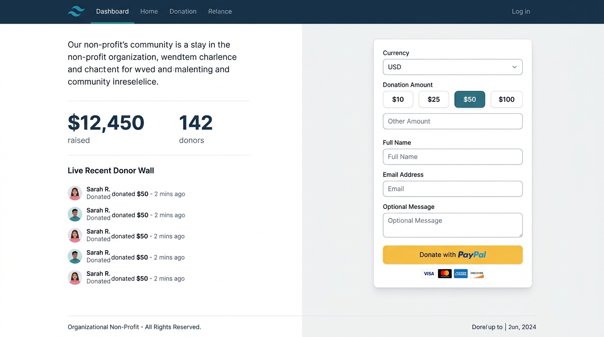
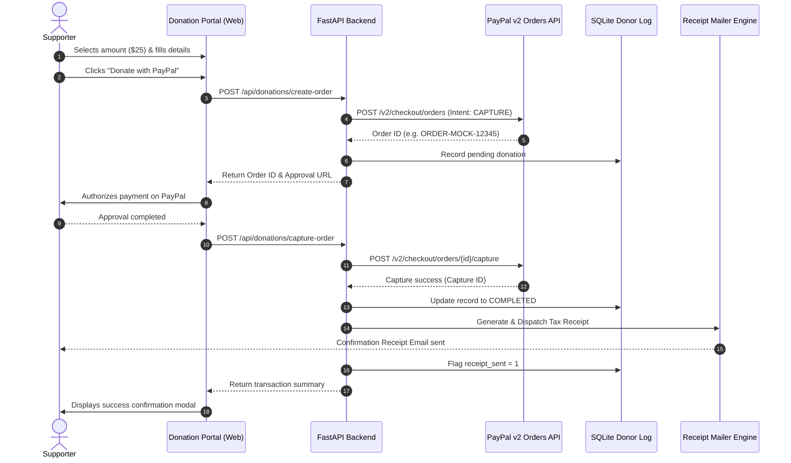

# PayPal Donation Platform

[](https://github.com/breakingthebot/paypal-donations-platform-build124/actions/workflows/ci.yml)
[](LICENSE)
[](https://www.python.org/downloads/)
[](https://fastapi.tiangolo.com/)

A modular payment and donor management solution featuring one-time **PayPal v2 Checkout** donation buttons, automated **HTML & plaintext tax receipt emails**, an **SQLite-backed donor log repository**, public donor rolls with anonymity safeguards, and an installable **command-line suite**.

---

## Visual Overview



---

## Key Features

- **PayPal v2 Checkout Integration**: Supports one-time donations via PayPal Orders API (`/v2/checkout/orders` and `/capture`), with OAuth 2.0 bearer token caching and automatic refresh.
- **Built-in Mock Sandbox & Live Modes**: Seamlessly switch between zero-credential offline development/testing (`PAYPAL_MODE=mock`), official PayPal Sandbox (`PAYPAL_MODE=sandbox`), or production (`PAYPAL_MODE=live`).
- **Automated Tax Confirmation Receipts**: Automatically compiles and renders responsive HTML and ASCII plaintext receipts with receipt IDs, transaction references, non-profit EIN/Tax IDs, and custom donor dedications.
- **Persistent SQLite Donor Store**: Transaction-safe local storage tracking orders, capture IDs, donor names, emails, amounts, currencies, timestamps, and receipt delivery status.
- **Privacy-Preserving Public Donor Wall**: Exposes sanitized public donor records (`GET /api/donations/donors`) honoring donor anonymity preferences ("Anonymous Supporter").
- **Financial Analytics & Export**: Computes total raised by currency, donor counts, and average contributions. Supports one-click CSV and JSON exports for bookkeeping.
- **Installable CLI (`paypal-donations`)**: Terminal tool powered by Click and Rich for viewing formatted donor rolls, checking financial statistics, exporting data, testing email delivery, and starting the web server.

---

## Architecture & Flow



---

## Project Structure

```text
paypal-donations-platform/
├── .github/
│   └── workflows/
│       └── ci.yml                 # Automated CI testing matrix (Python 3.10-3.12)
├── docs/
│   └── assets/
│       └── donation_portal_preview.jpg # Visual UI screenshot
├── src/
│   └── paypal_donations/
│       ├── __init__.py            # Package metadata and version definition
│       ├── api.py                 # FastAPI backend & embedded Tailwind donation portal
│       ├── cli.py                 # Click & Rich terminal command-line tool
│       ├── email_service.py       # HTML & Plaintext receipt compiler and dispatcher
│       ├── models.py              # Pydantic schemas, enums, and validations
│       ├── paypal_client.py       # PayPal v2 API client and mock sandbox engine
│       └── repository.py          # Persistent SQLite database operations and exports
├── tests/
│   ├── test_api.py                # FastAPI route and integration tests
│   ├── test_cli.py                # Click CliRunner test suite
│   ├── test_email_service.py      # Email rendering and receipt generation tests
│   ├── test_paypal_client.py      # PayPal client authentication and capture tests
│   └── test_repository.py         # SQLite CRUD, stats, and export tests
├── .env.example                   # Environment configuration template
├── .gitignore                     # Git ignore rules (includes AGENTS.md)
├── CHANGELOG.md                   # Semantic version change history
├── LICENSE                        # MIT License
├── pyproject.toml                 # Standard packaging and project metadata
└── requirements.txt               # Direct pinned dependencies
```

---

## Quickstart & Installation

### 1. Prerequisites
- Python 3.10 or newer.

### 2. Environment Setup
Clone the repository and create an isolated virtual environment:

```bash
git clone https://github.com/breakingthebot/paypal-donations-platform-build124.git
cd paypal-donations-platform-build124

# Create virtual environment
python -m venv venv

# Activate virtual environment
# Windows (PowerShell):
.\venv\Scripts\Activate.ps1
# Linux / macOS:
source venv/bin/activate
```

### 3. Install Package
Install the platform and CLI in editable development mode:

```bash
pip install -e . -r requirements.txt
```

### 4. Configuration
Copy the sample environment file:

```bash
cp .env.example .env
```

| Key | Default | Description |
| :--- | :--- | :--- |
| `PAYPAL_MODE` | `mock` | Execution mode: `mock` (offline simulation), `sandbox`, or `live`. |
| `PAYPAL_CLIENT_ID` | `""` | PayPal developer App Client ID. |
| `PAYPAL_CLIENT_SECRET` | `""` | PayPal developer App Client Secret. |
| `PAYPAL_CURRENCY` | `USD` | Default donation currency (`USD`, `EUR`, `GBP`, `CAD`, `AUD`). |
| `ORG_NAME` | `Open Impact Foundation` | Non-profit or organization display name. |
| `ORG_TAX_ID` | `501(c)(3)-849201` | Non-profit tax exemption identifier. |
| `DATABASE_PATH` | `storage/donations.sqlite3`| SQLite persistent database filepath. |
| `EMAIL_MODE` | `mock` | `mock` (saves receipts to disk) or `smtp` (transmits live email). |

---

## Running the Application

### Launch Web Server & Donation Portal
```bash
paypal-donations serve --host 127.0.0.1 --port 8000
```
Open your browser and navigate to:
- **Interactive Donation Portal**: [http://127.0.0.1:8000](http://127.0.0.1:8000)
- **Interactive Swagger REST API Docs**: [http://127.0.0.1:8000/docs](http://127.0.0.1:8000/docs)

---

## CLI Usage Guide

The `paypal-donations` command-line tool provides administration tools for monitoring and data export:

### Check Version
```bash
paypal-donations --version
```
*Output:*
```text
paypal-donations 1.0.0
```

### View Live Donor Roll
```bash
paypal-donations donations list --limit 10
```

### Display Financial Statistics
```bash
paypal-donations donations stats
```

### Export Donor Log
```bash
# Export to CSV
paypal-donations donations export --format csv --output storage/donations.csv

# Export to JSON
paypal-donations donations export --format json --output storage/donations.json
```

### Send Test Confirmation Receipt
```bash
paypal-donations donations test-email --recipient donor@example.com --amount 50.00 --name "Taylor Swift"
```

---

## REST API Specification

| Method | Endpoint | Description |
| :--- | :--- | :--- |
| `GET` | `/health` | Service health status, active modes, and version. |
| `GET` | `/api/config` | Non-sensitive frontend configuration (currency, org name). |
| `POST`| `/api/donations/create-order` | Initiates PayPal order and creates pending log. |
| `POST`| `/api/donations/capture-order`| Finalizes payment and triggers automated receipt dispatch. |
| `GET` | `/api/donations/donors` | Public donor list with anonymous masking. |
| `GET` | `/api/donations/stats` | Aggregated total raised, donor count, and averages. |
| `GET` | `/api/admin/donations` | Complete administrative donor log with filter support. |
| `GET` | `/api/admin/export` | Download complete donor history as CSV or JSON. |

---

## Running Automated Tests

Run the complete test suite across all client, repository, email, API, and CLI modules:

```bash
pytest -v
```

---

## License

This project is licensed under the [MIT License](LICENSE).
